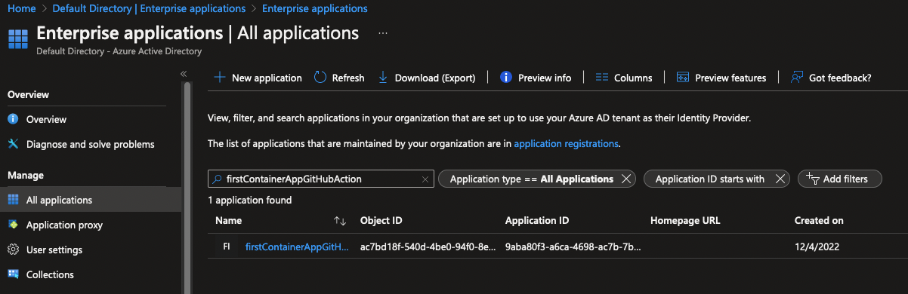

# Service principal creation

The purpose of service principal creation is to allow authentication from the GitHub Action to your Azure subscription.

## Create service principal

1. Ensure you have ran `az-login`
2. Review [1-service-principal-creation.sh](https://github.com/thomast1906/deploy-first-containerapp-terraform/blob/main/1-setup/scripts/1-service-principal-creation.sh)
3. Run the script `./scripts/1-service-principal-creation.sh`
4. The script will create:
- A service connection called `firstContainerAppGitHubAction`
- Grant contributor access to your subscription for the newly created service connection.
5. Review output of script, it will display values that you will need in the next section [2-configure-github-secrets.md](https://github.com/thomast1906/deploy-first-containerapp-terraform/blob/main/1-setup/2-configure-github-secrets.md)example output:
```
{
  "clientId": "XXXXXX",
  "clientSecret": "XXXXXX",
  "subscriptionId": "XXXXXX",
  "tenantId": "XXXXXX",
  "activeDirectoryEndpointUrl": "https://login.microsoftonline.com",
  "resourceManagerEndpointUrl": "https://management.azure.com/",
  "activeDirectoryGraphResourceId": "https://graph.windows.net/",
  "sqlManagementEndpointUrl": "https://management.core.windows.net:8443/",
  "galleryEndpointUrl": "https://gallery.azure.com/",
  "managementEndpointUrl": "https://management.core.windows.net/"
}
```
6. Reviewing in Azure Portal you will see the newly created service principal
