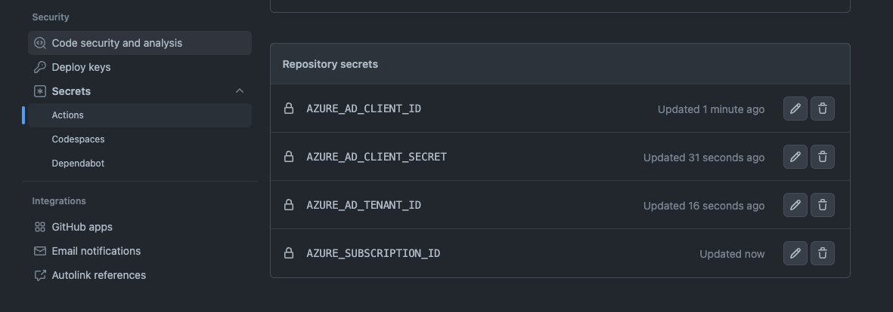

# Configure GitHub Secrets

The purpose of this is to save Service Principal credentials within GitHub Repository as secrets

## Create service principal

1. Within the GitHub repository to where you are going to be running the terraform from, select settings -> secrets
2. Add the 4 secrets from the output of script ran in [1-service-principal-creation.md](https://github.com/thomast1906/deploy-first-containerapp-terraform/blob/main/1-setup/1-service-principal-creation.md)

- AZURE_AD_CLIENT_ID – Will be the `clientId` value
- AZURE_AD_CLIENT_SECRET – Will be the `clientSecret` value
- AZURE_AD_TENANT_ID – Will be the `tenantId` value
- AZURE_SUBSCRIPTION_ID – Will be the `subscriptionId` value
- AZURE_CREDENTIALS - Will be whole json output including {}

