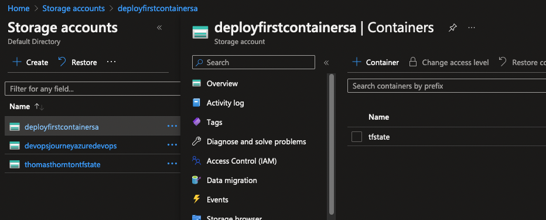

# Azure Terraform Setup

The purpose of this lab is to create the location that will store the remote Terraform State file

When deploying Terraform there is a requirement that it must store a state file; this file is used by Terraform to map Azure Resources to your configuration that you want to deploy, keeps track of meta data and can also assist with improving performance for larger Azure Resource deployments.

## Create Blob Storage location for Terraform State file
1. Edit the [variables](https://github.com/thomast1906/deploy-first-containerapp-terraform/blob/main/2-setup-terraform/scripts/1-create-terraform-storage.sh#L6-L7)
2. Run the script `./scripts/1-create-terraform-storage.sh`
3. The script will create
- Azure Resource Group
- Azure Storage Account
- Azure Blob storage location within Azure Storage Account
4. Successful script run will create a storage account with blob:
