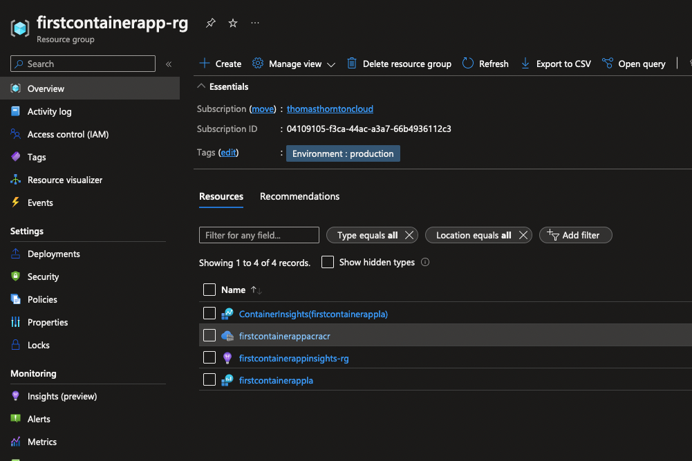

# Enable and run GitHub Action

The purpose of this lab is to enable and run the GitHub Action to Terraform and Apply the Terraform base.

## Run the GitHub Action
1. You may want to update these terraform variables prior to running the action:
- [app_name](https://github.com/thomast1906/deploy-first-containerapp-terraform/blob/main/3-deploy-terraform-base/terraform/variables.tf#L4) - Used as a concat for the various resources, such as resource group name etc
- [location](https://github.com/thomast1906/deploy-first-containerapp-terraform/blob/main/3-deploy-terraform-base/terraform/variables.tf#L10) - Location for Azure resources to be deployed
- [environment](https://github.com/thomast1906/deploy-first-containerapp-terraform/blob/main/3-deploy-terraform-base/terraform/variables.tf#L16) - A meaningful environment name, I used `production` as default. This variable is used as an Azure tag to reference all resources if needed.
2. Uncomment and merge this [GitHub workflow](https://github.com/thomast1906/deploy-first-containerapp-terraform/blob/main/.github/workflows/main.yml)
3. Manually run the workflow, currently it is not automatic. We will enable automatic action during merge at a later stage.
- Select Run workflow and main branch as screenshot shows below:

4. When successfully ran you can view each of the GitHub Action stages as below screenshot shows output from `Terraform Plan Base` stage:

5. Reviewing in Azure Portal, you will see the terraform base resources deployed successfully.
