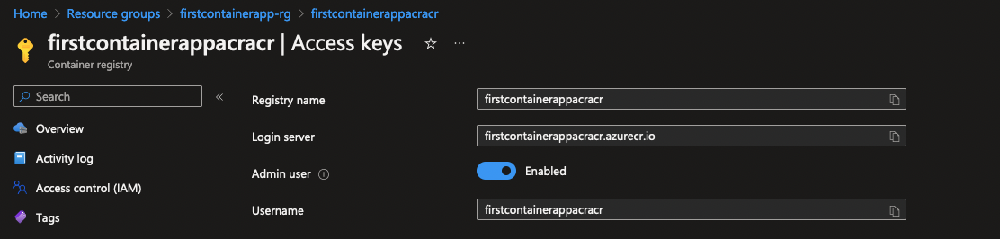

# ACR GitHub Secrets

To allow the GitHub action to successfully Build and deploy the image to the Azure Container Registry, we need to add additional GitHub repository secrets.

## Update GitHub repository secrets with ACR credentials

1. Select Azure Container Registry which you created -> Access Keys tab within settings

2. Add 3 secrets as below from the access keys tab:
- REGISTRY_LOGIN_SERVER - Login server
- REGISTRY_USERNAME - Username
- REGISTRY_PASSWORD - Password

