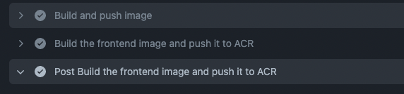
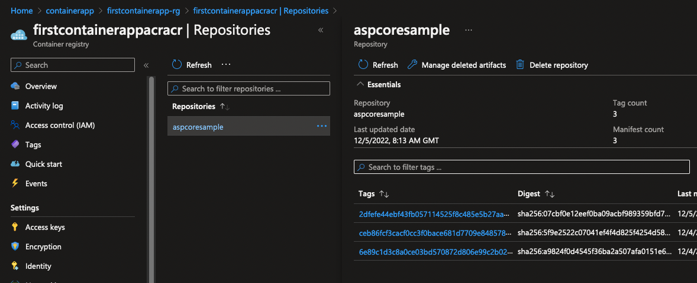

# Update GitHub Action

To allow the GitHub action to successfully Build and deploy the image to the Azure Container Registry, we need to add additional GitHub repository secrets.

## Update GitHub repository secrets with ACR credentials

1. Select Azure Container Registry which you created -> Access Keys tab within settings


2. Add 3 secrets as below from the access keys tab:
- REGISTRY_LOGIN_SERVER - Login server
- REGISTRY_USERNAME - Username
- REGISTRY_PASSWORD - Password

3. Apply the below to the bottom of the GitHub action [here](https://github.com/thomast1906/deploy-first-containerapp-terraform/blob/main/.github/workflows/main.yml)

- Notice the reference of `${{ github.sha }} ` ? This will tag your image with the current GitHub sha.
- Within tags value, please update `firstcontainerappacracr` to your ACR
```
    - name: 'Build and push image'
      uses: azure/docker-login@v1
      with:
        login-server: ${{ secrets.REGISTRY_LOGIN_SERVER }}
        username: ${{ secrets.REGISTRY_USERNAME }}
        password: ${{ secrets.REGISTRY_PASSWORD }}
    - name: Build the frontend image and push it to ACR
      uses: docker/build-push-action@v2
      with:
        push: true
        tags: firstcontainerappacracr.azurecr.io/aspcoresample:${{ github.sha }}
        file: aspnet-core-dotnet-core/Dockerfile
```
4. When successfully ran, you will see a successful run in the GitHub action as below:


5. With each successful run of the GitHub Action, a new image will be uploaded to the Container Registry
