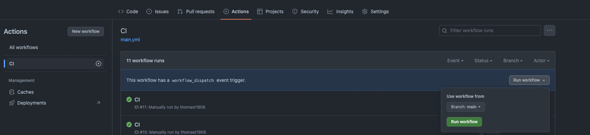
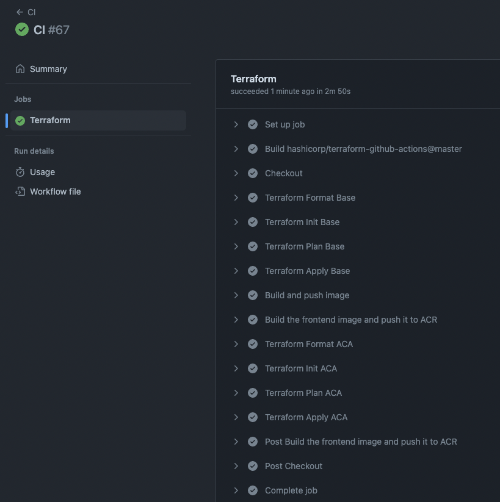
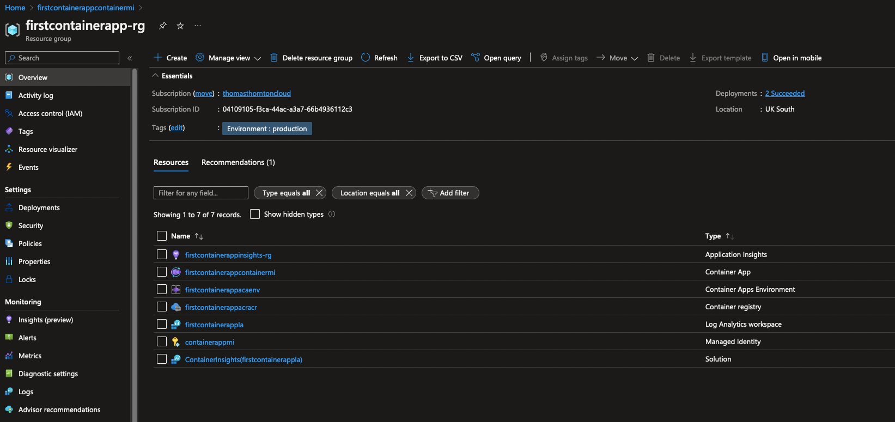
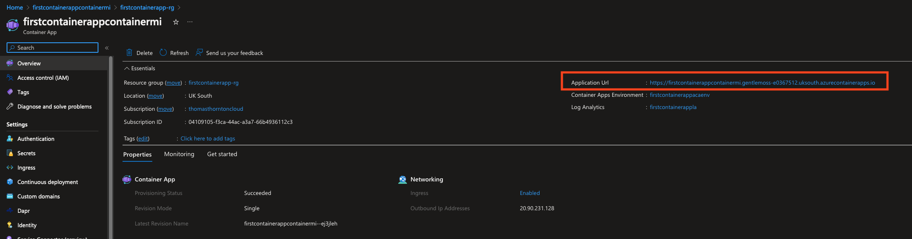
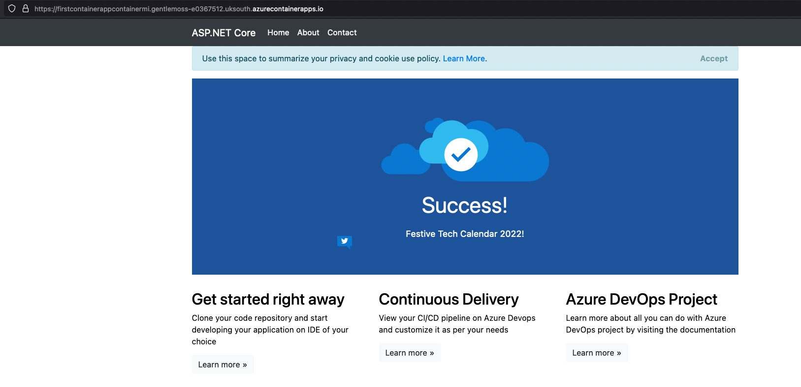

# Configure GitHub Action to create Azure Container App

The purpose of this lab is to enable and run the GitHub Action to Terraform and Apply the Azure Container environment and App.

## Run the GitHub Action
1. You may want to update these terraform variables prior to running the action:
- [app_name](https://github.com/thomast1906/deploy-first-containerapp-terraform/blob/main/5-Deploy-Container-App-Terraform/terraform/variables.tf#L4) - Used as a concat for the various resources, such as resource group name etc
- [location](https://github.com/thomast1906/deploy-first-containerapp-terraform/blob/main/5-Deploy-Container-App-Terraform/terraform/variables.tf#L10) - Location for Azure resources to be deployed
- [environment](https://github.com/thomast1906/deploy-first-containerapp-terraform/blob/main/5-Deploy-Container-App-Terraform/terraform/variables.tf#L16) - A meaningful environment name, I used `production` as default. This variable is used as an Azure tag to reference all resources if needed.
3. Apply the below to the bottom of the GitHub action [here](https://github.com/thomast1906/deploy-first-containerapp-terraform/blob/main/.github/workflows/main.yml)

```
    - name: 'Terraform Format ACA'
      uses: hashicorp/terraform-github-actions@master
      with:
        tf_actions_version: ${{ env.TF_VERSION }}
        tf_actions_subcommand: 'fmt'
        tf_actions_working_dir: "./5-deploy-containerapp-terraform/terraform"
         
    - name: 'Terraform Init ACA'
      uses: hashicorp/terraform-github-actions@master
      with:
        tf_actions_version: ${{ env.TF_VERSION }}
        tf_actions_subcommand: 'init'
        tf_actions_working_dir: "./5-deploy-containerapp-terraform/terraform"
        args: '-var="GITHUB_SHA=${{ github.sha }}"'

    - name: 'Terraform Plan ACA'
      uses: hashicorp/terraform-github-actions@master
      with:
        tf_actions_version: ${{ env.TF_VERSION }}
        tf_actions_subcommand: 'plan'
        tf_actions_working_dir: "./5-deploy-containerapp-terraform/terraform"
        args: '-var="GITHUB_SHA=${{ github.sha }}"'
 
    - name: 'Terraform Apply ACA'
      if: github.ref == 'refs/heads/main'
      uses: hashicorp/terraform-github-actions@master
      with:
        tf_actions_version: ${{ env.TF_VERSION }}
        tf_actions_subcommand: 'apply'
        tf_actions_working_dir: "./5-deploy-containerapp-terraform/terraform"
        args: '-var="GITHUB_SHA=${{ github.sha }}"'
```

4. Manually run the workflow, currently it is not automatic. We will enable automatic action during merge at a later stage.
- Select Run workflow and main branch as screenshot shows below:


5. When successfully ran you can view each of the GitHub Action stages as below screenshot shows pipeline ran successfully with the newly created stages added:


6. Reviewing in Azure Portal, you will see the terraform base resources deployed successfully.


7. Access the application URL from within Azure Portal of Container Application:


8. With a successfully deploy container app, URL will be accessible as below:
