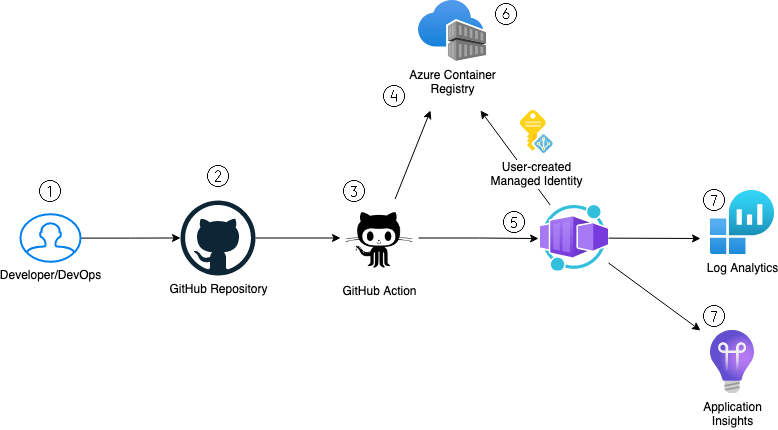
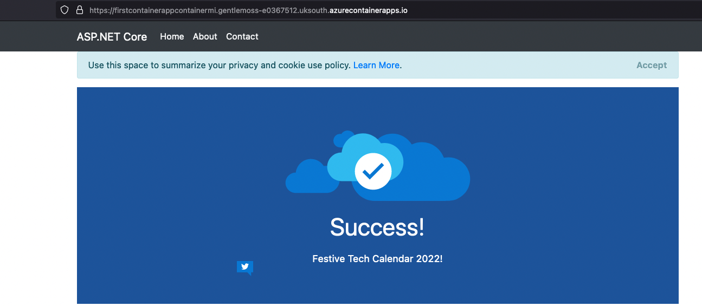

# deploy-first-containerapp-terraform

This tutorial/lab has been created to take you through a DevOps journey to build & deploy an Azure Container Application using Terraform and GitHub Actions. 

It will include from setting up the GitHub pipeline, prerequisites and finishing with a successful Container Application being deployed - along with looking at alerting/monitoring!

As with my tutorials/labs, it is an example of a real-world setup!

# What you will learn

In this tutorial/lab, you will learn:
- Setup your Azure subscription & create service principal to authenticate between GitHub repo and Azure
- Prerequisites to configure terraform storage
- Use Terraform to deploy container app along with other services including Log Analytics & Application Insights
- Build and deploy example container application to Azure Container Registry
- An understanding of CI/CD with automated application deployments
- Reviewing monitoring and alerting using Application & Container Insights

# How the labs work

To run this tutorial/lab successfully, please review each folder - inside each folder has a number of *.md files, starting from 1..2 etc. complete each one in number sequence 1...2...3...etc

- [Review Prerequisities](https://github.com/thomast1906/deploy-first-containerapp-terraform/blob/main/prerequisites.md)

- [Lab 1 - Initial Setup](https://github.com/thomast1906/deploy-first-containerapp-terraform/tree/main/1-setup)
    - Service principal creation
    - Configure GitHub secrets with newly created service principal

- [Lab 2 - Setup For Terraform](https://github.com/thomast1906/deploy-first-containerapp-terraform/tree/main/2-setup-terraform)
    - Setup remote storage account/blob for Terraform .tfstate files

- [Lab 3 - Deploy Terraform Base](https://github.com/thomast1906/deploy-first-containerapp-terraform/tree/main/3-deploy-terraform-base)
    - Enabling GitHub Action to begin deploying Azure resources
    - Deploys Azure resources ready to begin deploying Container Application

- [Lab 4 - Build & Deploy Application](https://github.com/thomast1906/deploy-first-containerapp-terraform/tree/main/4-Build-deploy-application-to-ACR)
    - Build and deploy test application to Azure Container Registry

- [Lab 5 - Deploy Container App using Terraform](https://github.com/thomast1906/deploy-first-containerapp-terraform/tree/main/5-deploy-containerapp-terraform)
    - Deploy container environmenet and application with the image created in lab 4.

- [Lab 6 - Monitoring & Alerting](https://github.com/thomast1906/deploy-first-containerapp-terraform/tree/main/6-monitoring-and-alerting)
    - Reviewing Application Insights and Log Analytics data generated from deployed container app

# Deployment Overview
Once we commit a change to the source code – we want the Container Application to have been deployed with the latest commit automatically.

1. Developers/DevOps commits code change to GitHub Repository
2. Change is merged into GitHub Repository
3. GitHub Action/Workflow runs the relevant steps required to update/deploy the Azure resources and image
4. Latest image is built and deployed to Azure Container Registry
5. GitHub Action updates Container App with latest image tag
6. Container App pulls latest image from Azure Container Registry using Managed Identity to authenticate
7. Container App is monitored both using Log Analytics & Container Insights

Azure resources that will be deployed 

Example containerapp

# Thank you
Thank you for taking the time to work on this tutorial/labs. Let me know what you thought!

Feel free to check out my blog for more awesome content!
https://thomasthornton.cloud/ 

Ensure to follow me on GitHub. Please star/share this repository! 12